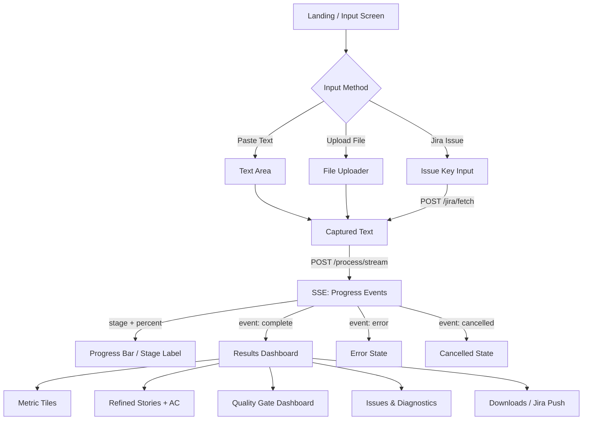

# DeepSpeci — Frontend Handoff Document

**ZenseAI.QI** | DeepSpeci 

## 1. Overview

DeepSpeci is an AI-powered requirements analysis tool. The UI collects requirement text (typed, uploaded, or fetched from Jira), sends it to a backend pipeline, and renders structured quality analysis results — refined stories, scores, gate verdicts, and diagnostics.

---

## 2. Input Flows

### Text Input
- User pastes raw requirement text into a textarea
- UI captures the string and sends it as `{ "text": "<content>" }`

### File Upload
- User uploads a file (PDF, DOCX, TXT, MD, PNG, JPG)
- UI extracts text client-side or sends to backend for extraction
- Extracted text is used as the `text` payload — same as manual input

### Jira Fetch
- User enters a Jira issue key (e.g. `PROJ-123`)
- UI calls `POST /api/v1/jira/fetch` with `{ "issue_key": "PROJ-123" }`
- Response provides `summary` + `description` → concatenated as `text` payload
- Jira connection status available via `GET /api/v1/jira/status`

> **All three flows converge into the same pipeline call:** `POST /api/v1/process/stream`

---

## 3. User Flow Diagram



---

## 4. Screens / UI States

### Input Screen
- Three-tab input: Text | File Upload | Jira
- "Analyze" button (disabled until text is present)
- Optional: model/config selector

### Processing State
- Progress bar driven by SSE `percent` field (0–100)
- Stage label from SSE `stage` field (e.g. "Classifying document…", "Running quality gates…")
- Cancel button → `POST /process/cancel?task_id=<id>`
- `task_id` received from the first SSE event (`started`)

### Results Dashboard
- **Metric tiles row:** Doc Type, Domain, Pre-Score, Post-Score, Improvement %, Gate Compliance, Pipeline Time, Story Count
- **Issues panel:** vague language, missing criteria, duplicates, contradictions, failing gate diagnostics
- **Refined Stories:** expandable cards with original→refined diff, acceptance criteria (Given/When/Then), improvement notes
- **Quality Gate table:** 9 gates × pre/post/delta columns, expandable per-gate details
- **Validation summary:** INVEST compliance flags, critique feedback
- **Export options:** TXT report, Full JSON, Stories JSON, Traceability ZIP
- **Push to Jira:** create issues from refined stories

### Error / Empty States
- Pipeline error → show `detail` message from SSE error event
- Cancelled → show "Analysis cancelled" with retry option
- Partial data → render whatever fields are present, hide missing sections

---

## 5. Output Structure

The `complete` SSE event delivers a `result` object. Key fields the UI must render:

```jsonc
{
  // Metadata
  "document_type": "BRD",              // string
  "domain": "FinTech",                 // string
  "total_time_seconds": 42.3,          // number

  // Scores
  "pre_refinement_score": 62,          // 0-100
  "validation_score": 81,              // 0-100 (post-refinement LLM)
  "llm_pre_score": 62,                // 0-100
  "llm_post_score": 81,               // 0-100
  "overall_quality_score": 87.3,       // 0-100 (blended gate score)
  "improvement_score": 19,             // delta
  "improvement_percentage": 30.6,      // percent

  // Stories
  "user_stories": [
    {
      "story_id": "US-001",
      "title": "...",
      "description": "As a [role], I want [action], So that [benefit]",
      "acceptance_criteria": [
        "AC1: Given [ctx], When [action], Then [result]"
      ]
    }
  ],
  "original_stories": [ /* same shape — for diff display */ ],
  "improvement_notes": [
    { "story_id": "US-001", "changes": "Removed vague term; Added SLA" }
  ],
  "invest_compliance": [
    { "story_id": "US-001", "independent": true, "negotiable": true,
      "valuable": true, "estimable": true, "small": true, "testable": false,
      "issues": ["Not independently testable"] }
  ],

  // Quality Gates
  "pre_gate_results": { /* gate_results object */ },
  "post_gate_results": {
    "overall_score": 87.3,
    "overall_pass": true,
    "gates_passed": 8,
    "gates_total": 9,
    "gate_results": {
      "gate_1_6cs":        { "score": 91, "pass": true, "dimensions": {} },
      "gate_2_regulatory": { "score": 100, "pass": true, "checks": [] },
      "gate_3_moscow":     { "score": 85, "pass": true },
      "gate_4_okr":        { "score": 75, "pass": true },
      "gate_5_feasibility":{ "score": 80, "pass": true },
      "gate_6_security":   { "score": 100, "pass": true, "categories": {} },
      "gate_7_duplicate":  { "score": 100, "pass": true, "duplicates": [] },
      "gate_8_test_readiness": { "score": 88, "pass": true },
      "gate_9_risk":       { "score": 78, "pass": true, "per_story": [] }
    },
    "blocking_gates": []
  },
  "gate_comparison": [ /* pre vs post per gate */ ],

  // Diagnostics
  "ambiguity_report": [],
  "conflict_report": [],
  "testability_report": [],
  "duplication_report": [],
  "critique_feedback": "...",

  // Timing
  "stage_timings": { "classify": 1.2, "gates_pre": 5.4 }
}
```

---

## 6. UI Components Needed

| Component | Purpose |
|-----------|---------|
| **Tab input form** | Text area, file uploader, Jira key field |
| **File uploader** | PDF/DOCX/TXT/MD/PNG/JPG with drag-and-drop |
| **Jira connector** | Status badge, issue key input, fetch button |
| **Progress bar** | Driven by SSE percent + stage label |
| **Cancel button** | Calls `/process/cancel` with `task_id` |
| **Metric tiles** | Row of score cards (pre, post, improvement, gate score, time) |
| **Story cards** | Expandable: title, description, AC list, original vs refined diff |
| **Gate dashboard** | Table with 9 gates: name, pre-score, post-score, delta, pass/fail badge |
| **Gate detail panels** | Expandable: sub-scores, per-story breakdown, diagnostics |
| **Issues panel** | Grouped by type: vague language, conflicts, testability, duplicates |
| **INVEST badges** | Per-story: 6 boolean flags (I/N/V/E/S/T) |
| **Download buttons** | TXT, Full JSON, Stories JSON, Trace ZIP |
| **Jira push panel** | Create issues from refined stories |

---

## 7. Notes for Frontend

- **Dynamic rendering:** Not all fields are always present. Check for existence before rendering (e.g. `gate_comparison` may be empty, `rag_context` may be `""`).
- **SSE handling:** Use `EventSource` or fetch + `ReadableStream`. Events arrive as `data: {json}\n\n`. Parse each line.
- **Loading UX:** Pipeline runs 30–120s. Show progress stage names to keep user engaged. Key stages: Classifying → Extracting → Generating Stories → Quality Gates → Refining → Final Gates.
- **Partial data:** If pipeline errors mid-run, the `complete` event won't fire. Show whatever was received via progress events and display the error.
- **Score display:** Pre/post scores are 0–100. Color-code: red < 60, yellow 60–79, green >= 80.
- **Gate pass/fail:** Each gate has a `pass` boolean and `threshold`. Highlight blocking gates (listed in `blocking_gates` array).
- **Cancellation:** Store `task_id` from the `started` SSE event. Wire cancel button to `POST /process/cancel?task_id=<id>`.
- **CORS:** Backend allows all origins. No special headers needed.
- **Base URL:** API is available at both `/` and `/api/v1/` prefix.
